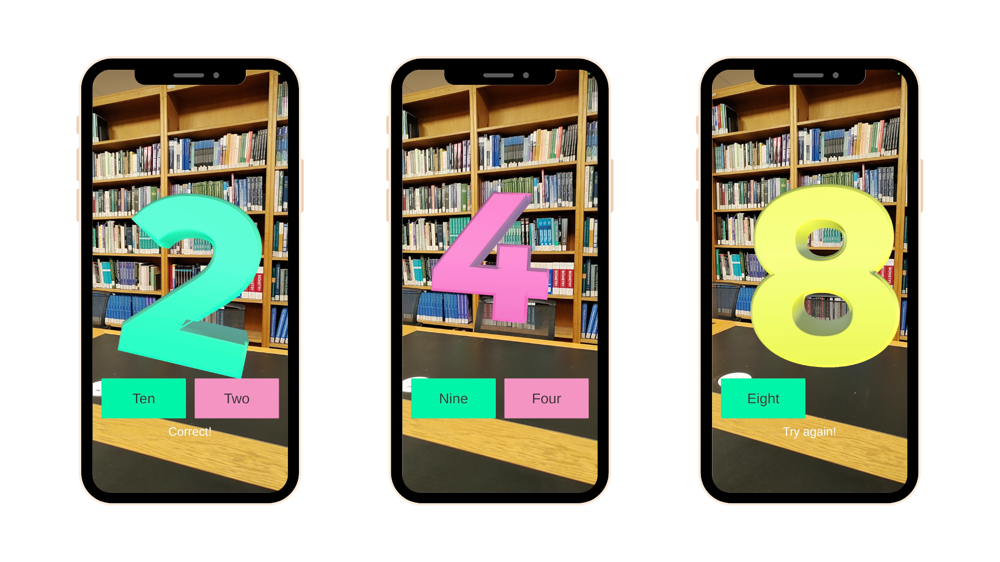

# AR Number Game

## Requirements
- Unity 6.0
- ARFoundation 6.06
- Google ARCore XR Plugin 6.06
- Android device that supports AR ([Android Requirements](https://developers.google.com/ar/devices))

## Features
- Random number between 1 to 10 will appear in world space
- Voice-overs (eg. "U got it!", "Try again", "Count to the number out loud!")
- Wobble animation to attract attention
- Scoring system

## Setup
- Clone this repository
- Open in Unity
- Build to device (File -> Build and Run)

